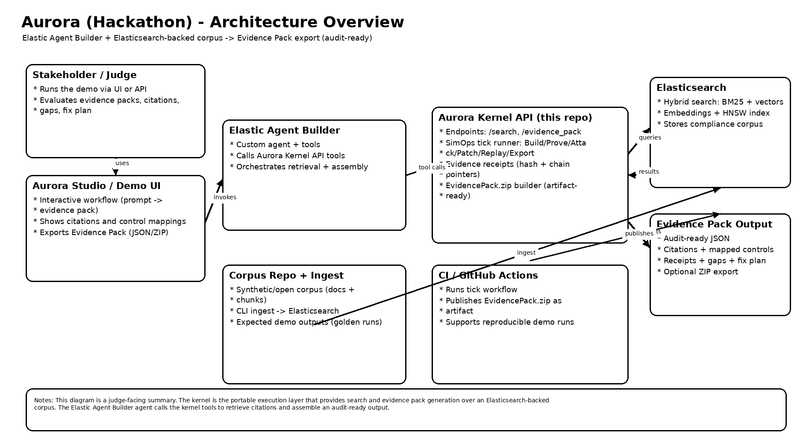

# Aurora Kernel — Architecture



## Big picture

Aurora Kernel is a FastAPI backend that generates **AI compliance evidence packs**. It is designed to be:

- Easy to demo during a hackathon
- Extendable into a fuller compliance workflow
- Compatible with Elastic (indexing + retrieval) and agent-based orchestration

## Core components

| Component | Role |
|-----------|------|
| **FastAPI service** | Request/response interface to create, validate, and export evidence packs |
| **Evidence Pack builder** | Normalizes evidence into a predictable schema (controls → evidence → gaps → remediation) |
| **Elastic layer** | Indexes packs into Elasticsearch for retrieval, traceability, and search |
| **Agent Builder bridge** | Routes requests through Elastic Agent Builder for AI-grounded evidence generation |
| **Scenario Packs** | Curated prompts + test cases from the [corpus repo](https://github.com/HooplaHoorah/aurora-hackathon-corpus) |

## Data flow (typical)

1. **User selects a scenario** (or uploads a scenario pack) via Aurora Studio.
2. **Kernel runs the scenario** to produce:
   - Controls (mapped to the scenario's regulatory context)
   - Evidence objects (retrieved from the Elastic index)
   - Gaps (where evidence is missing or weak)
   - Remediation plan (actionable next steps)
   - Audit trail metadata (timestamps, hashes, chain pointers)
3. **Output is exported** as a portable Evidence Pack (JSON + Markdown).
4. **Optional:** Index the pack back into Elastic for search, replay, and reporting.

## Mode selection

Aurora Kernel supports two modes:

- **Agent Builder mode** — routes the evidence generation through an agent created in Elastic Agent Builder, producing AI-grounded, citation-rich evidence packs.
- **Deterministic mode** — falls back to structured, rule-based evidence generation when Agent Builder is not configured or unavailable.

The frontend (Aurora Studio) auto-detects which mode is available via the `/agent/status` endpoint and adjusts the UI accordingly.

## Deployment topology

```
┌─────────────────┐     ┌─────────────────────────┐     ┌──────────────────┐
│  Aurora Studio   │────▶│     Aurora Kernel        │────▶│  Elasticsearch   │
│  (CloudFront)    │     │  (AWS App Runner)        │     │  (Elastic Cloud) │
└─────────────────┘     └─────────────────────────┘     └──────────────────┘
                              │                               ▲
                              ▼                               │
                        ┌─────────────────┐                   │
                        │  Agent Builder   │───────────────────┘
                        │  (Elastic)       │
                        └─────────────────┘
```

## Why this architecture wins for judges

- **End-to-end**: there is a clean demo path from scenario selection to exported evidence pack.
- **Traceable**: outputs are structured for governance — every claim maps to controls and evidence.
- **Composable**: scenario packs and evidence packs are portable artifacts.
- **Graceful degradation**: deterministic fallback ensures the demo always works.
